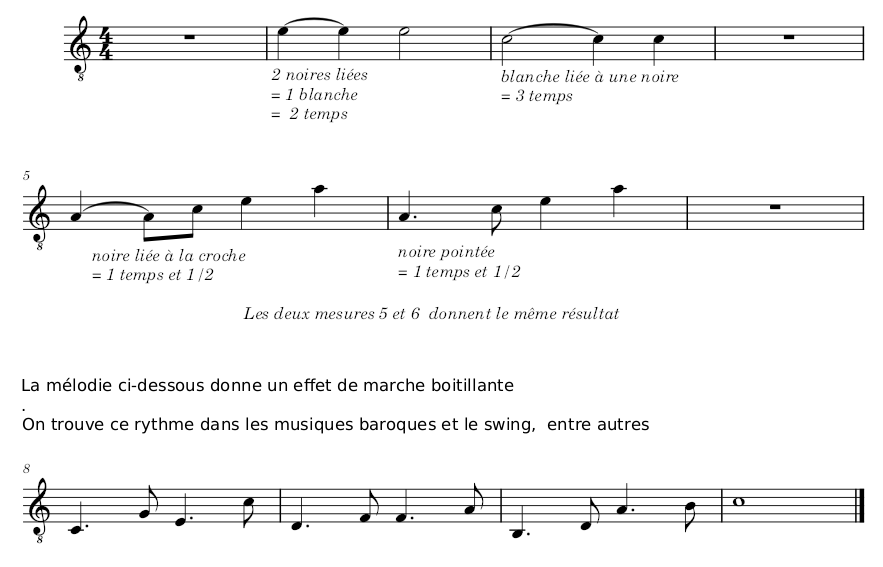
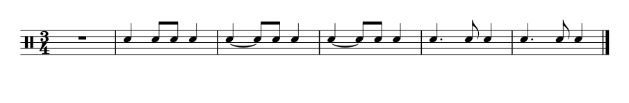

# Cours 02

## Liaisons et notes pointées
On a vu la noire vaut 1 temps, la blanche équivaut à deux noires et vaut 2 temps.  
La blanche est une noire prolongée d'un temps.  
La prolongation d'un son peut aussi se faire d'autres manières, en voici deux exemples:
 

###
## Avec le set de batterie
Tester avec une portée de batterie (snare)  

###
## Lecture d'extraits de musiques
- Extrait de la musique du film Braveheart
- Extrait du Siciliano de Carcassi
- Extrait de la musique du Château dans le ciel

