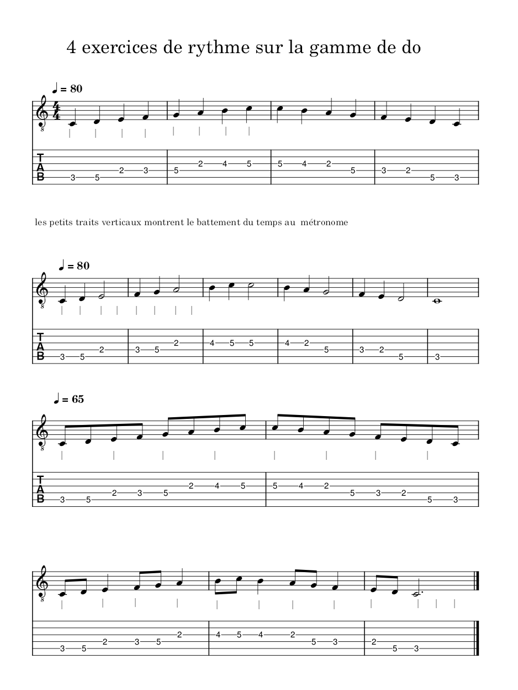
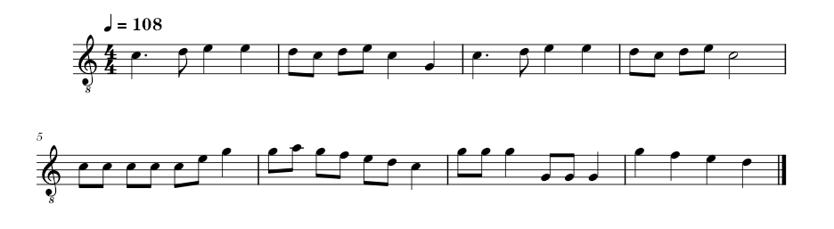

# Exercices basés sur le cours 1 et 2

## Jouer à la guitare
1. La gamme de do avec le métronome
- à la noire
- noire et blanche
- à la croche

### Exemples 
le fichier `rythmique-sur-gamme-do-guitare.mcz` est dans le dossier lire
  

### Comptine avec notes pointées
2. Jouer la partition de la comptine "Alouette"

