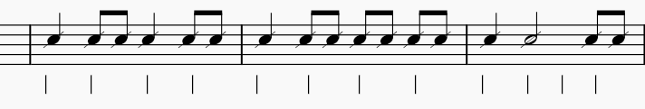
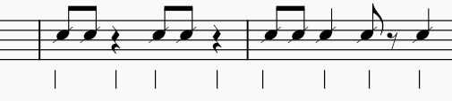
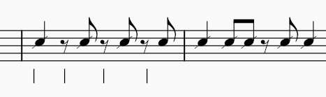

# Travail autour de la croche

## Durée de la croche
Dans un rythme binaire, elle vaut la moitié d'une noire.   
L'exemple suivant montre le tempo et la 2ème croche  jouée entre 2 tempos.  

###
## Croches et silences 
L'exemple suivant montre que le tempo tombe sur un silence.
###

## Contre-temps
Le tempo tombe sur un demi-soupir
###

## Travail de Lecture
1.  D'abord seulement avec le rythme. Voir : `drum-noire-blanche-croches.mscz`
2. On ajoute les notes. Voir  : `lecture-noire-blanche-croches.mscz`  
 
