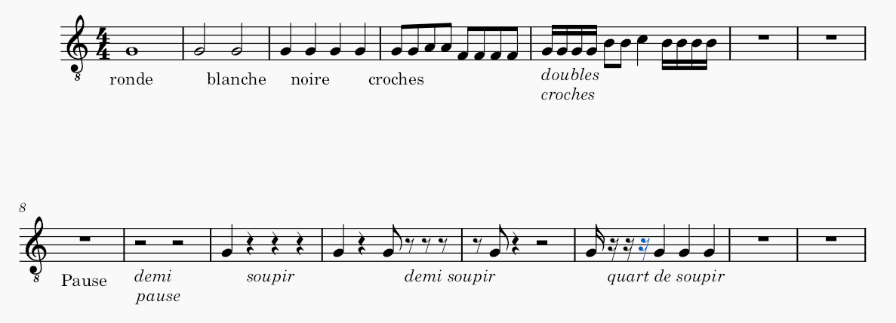

# Cours 01

## Créer une partition 
- Portée
- L’armature : clé, temps, tempo
- Les mesures
- Les 7 notes
###

## Figures de notes et de silences  
- Ronde, Blanche, Noire, Croche, Double-croche 
- Pause, Demi pause, Soupir, Demi-soupir, Quart de soupir
– Tester avec le set de batterie
###

## Etude des noires et des blanches 

- Ecrire la partition de la souris verte en noire et blanche . `On démarre avec la note : sol`
- Ecrire la partition de Frère jacques . `On démarre avec la note : do grave`
- Repérages sur le manche de la gamme de do `Voir le fichier joint`
- Application à la guitare et au métronome des comptines, seul et à deux . 

## Signes de reprise et renvoi

